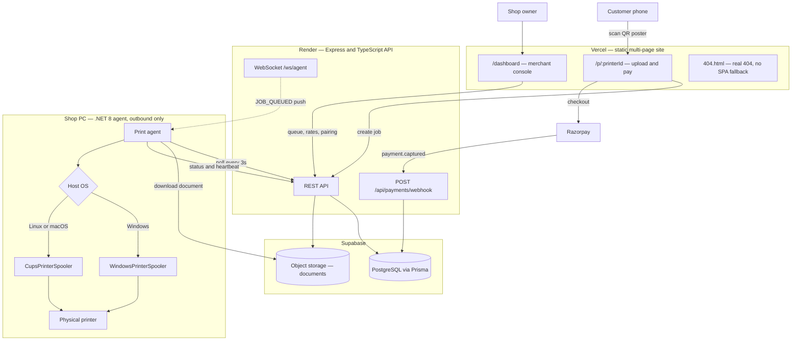
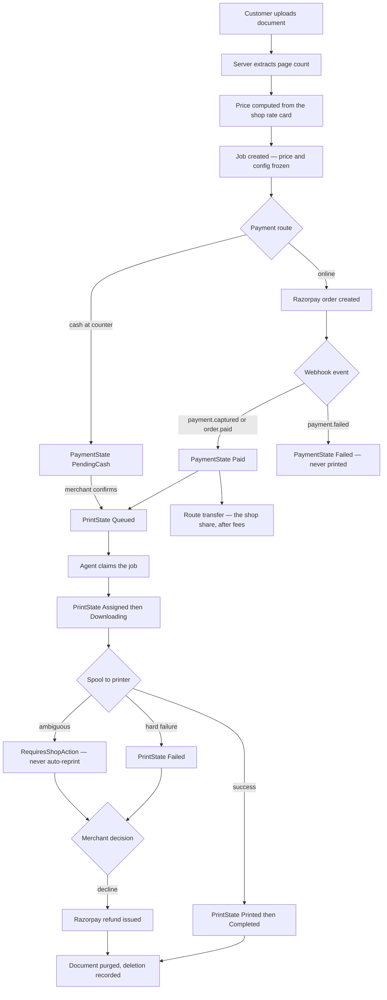
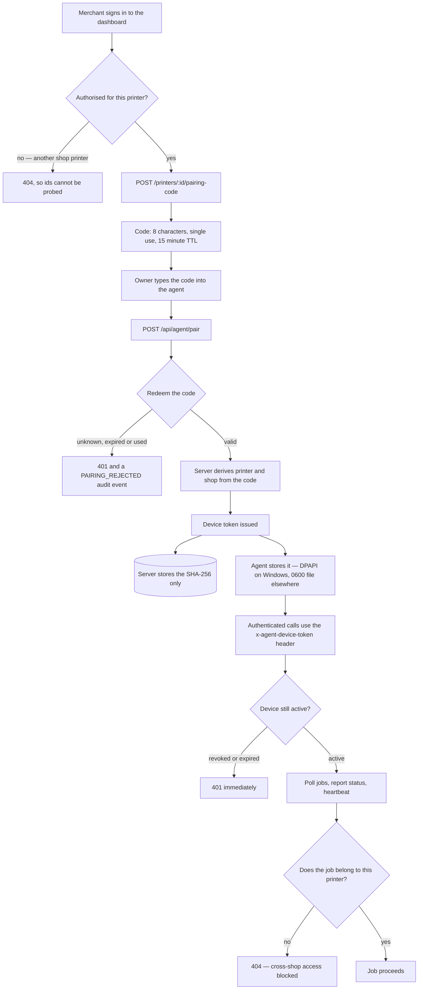
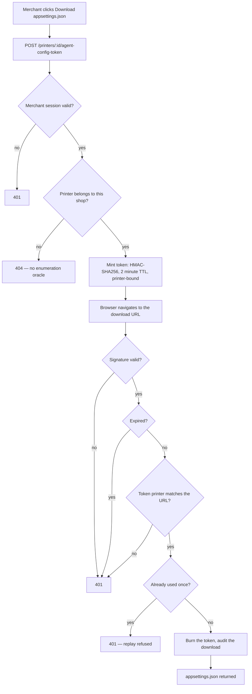
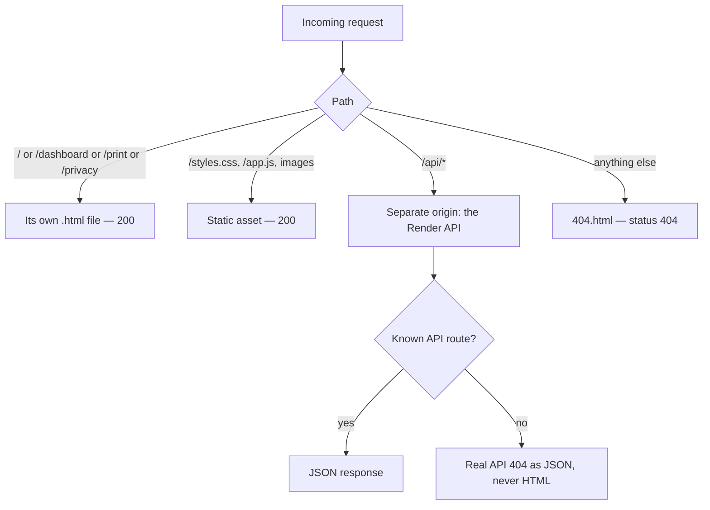

# PrintOk

Hardware-free printing for stationery shops. A customer scans the shop's QR code,
uploads a document on their phone, pays, and the shop's existing Windows PC prints
it automatically through a background agent. No new hardware, no counter queue.

**Status:** core pipeline built and deployed; not yet launched. See
[`docs/prd-status.md`](docs/prd-status.md) for a section-by-section assessment
against the PRD.

> **Nothing has physically printed through this system yet.** The agent is
> code-complete and CI-built, but has never run on a real Windows PC against a
> real printer. Treat everything in the agent path as unverified.

---

## Live surfaces

| Surface | URL | Purpose |
|---|---|---|
| Landing | `/` | Public marketing site and shop signup |
| Customer | `/print?printer=<id>` | What a QR scan opens |
| Merchant | `/dashboard` | Live queue, rate card, agent pairing, payouts |
| Admin | `/admin` | Platform operator console |
| API | `prinok-api.onrender.com` | Backend |

The site answers on `printok.vercel.app` and, because printed QR posters encode
it, also on the older `print-ok-customer-web.vercel.app`. Both are live; new QR
posters use whichever `PUBLIC_WEB_URL` names.

Existing QR posters encode `/?printer=<id>`; the root forwards those to `/print`
before rendering, so printed posters keep working.

---

## Repository layout

| Path | Contents |
|---|---|
| `apps/customer-web` | Static frontend: landing, customer flow, merchant dashboard, admin console |
| `services/api` | Express + Prisma API: jobs, payments, agent protocol, admin |
| `agent/windows-print-agent` | C# .NET 8 agent that runs on the shop PC |
| `packages/shared-types` | Shared TypeScript contracts and state enums |
| `infrastructure` | Local Docker Compose (Postgres, MinIO) |
| `docs` | Deployment guide and PRD status |

---

## How it fits together

```
Customer phone  ──upload & pay──▶  PrintOk API  ──job pushed──▶  Shop PC agent
                                   (Render)                      (Windows)
                                       │                              │
                                  Postgres +                   existing printer
                                object storage
                                   (Supabase)
```

Only the agent runs inside the shop, and it makes outbound connections only —
nothing is exposed on the shop's network.

---

## Architecture

### System topology

Three deployment targets, one database, and a shop PC that only ever dials out.



### Order lifecycle

Payment state and print state are separate columns with their own guarded
transition tables — a paid job is not a printed job, and neither is ever derived
from the other. Every transition is appended to `JobEvent`.



### Agent credential lifecycle

The shop PC never holds the printer shared key. It earns its own revocable,
device-scoped token, and the server stores only that token's SHA-256.



### Agent config download

The config file carries the printer agent API key, and printer ids are public —
they are on the QR poster. So the download is authorised per click, never by a
standing URL.



### Request routing

The frontend is a **multi-page static site**, not an SPA. There is no
client-side router, so there must be no catch-all rewrite to `index.html`: an
unmatched path has to reach `404.html` with a real 404 status.



**Rules for the two `vercel.json` files.** `vercel.json` at the repo root applies
when the Vercel project Root Directory is the repository root;
`apps/customer-web/vercel.json` applies when it is that folder. Only one is ever
live — currently the second, since the build runs `@printok/customer-web` — so
**keep them in step**.

- **No `_comment` or any other invented key.** Vercel validates `vercel.json`
  against a strict schema and fails the deploy with *"should NOT have additional
  property"*. Only real properties are allowed, which is why this note lives here
  and not in the file.
- **`routes` may not be combined with `cleanUrls`, `trailingSlash` or
  `rewrites`.** Mixing them returned 403 on every path in production once.
- **A `rewrite` cannot set a status code.** Only `routes` can, via
  `{ "status": 404 }` — which is the only way to serve a real 404 here.
- **Never add a catch-all rewrite to `index.html`.** If production serves the
  landing page for an unknown URL, the catch-all is a project-level rewrite in
  the Vercel dashboard, not in this repo.

Check it with:

```bash
curl -o /dev/null -w "%{http_code}\n" https://printok.vercel.app/nope   # expect 404
```

---

## Key design rules

These are load-bearing. Breaking one has caused a production bug before.

- **Payment state and print state are independent.** A paid job is not a printed
  job. Never derive one from the other.
- **Ambiguity goes to a human.** If a job may or may not have physically printed,
  it escalates to `RequiresShopAction` rather than reprinting. Reprinting
  double-charges and wastes paper.
- **Prices are frozen at quote time.** Each job stores the rate card it was priced
  with, so later rate changes cannot restate a past quote.
- **Money is integer paise.** Never floats. Commission is basis points.
- **Documents are deleted once a job reaches a terminal state**, and the deletion
  is recorded — including failures.
- **Each shop PC holds its own revocable credential.** Never the printer's shared
  key.

---

## Development

### Prerequisites

Node 20+, Docker (for Postgres), and .NET 8 SDK if working on the agent.

### Setup

```bash
cp .env.example .env          # then fill in real values
npm install
docker compose up -d postgres # local database
npm run build
```

> **Important:** point `DATABASE_URL` at **localhost** for development. Migrations run on
> application boot, and the API refuses to migrate a non-local database unless
> `NODE_ENV=production` — a guard that exists because a local run once came close
> to migrating production.

### Running

```bash
npm start --workspace=@printok/api        # API on :4000
node apps/customer-web/server.js          # frontend on :3000
```

### Tests

```bash
npm test                                  # API suite, in-memory storage
cd services/api && npm run test:db        # Postgres suite, provisions its own database
```

43 tests covering pricing, the state machine, idempotency, agent pairing and
revocation, payment signature verification, job recovery, and shop deletion
guards. The Postgres suite exists because the Prisma path was once entirely
untested and silently ignored every shop's rate card.

### Windows agent

```bash
dotnet publish agent/windows-print-agent/WindowsPrintAgent.csproj \
  -c Release -r win-x64 --self-contained true -p:PublishSingleFile=true -o bin/publish
```

The publish **must** be self-contained — a framework-dependent build produces a
~150 KB stub that cannot run on a shop PC. CI fails the build if the executable
comes out too small.

Shop-side setup: [`agent/windows-print-agent/INSTALL.md`](agent/windows-print-agent/INSTALL.md).

---

## Deployment

| Component | Host | Trigger |
|---|---|---|
| API | Render | Auto-deploy on push to `main` |
| Frontend | Vercel | Auto-deploy on push to `main` |
| Database & storage | Supabase | — |
| Agent binary | GitHub Releases | GitHub Actions on `agent/**` changes |

Migrations apply automatically on API boot, baselining the pre-Migrate database
on first run. `/health` reports the running commit, so a deploy is verifiable
from outside.

Details: [`docs/deployment-guide.md`](docs/deployment-guide.md).

---

## Required configuration

The API refuses to start, or refuses specific operations, when these are missing
— deliberately, rather than failing quietly.

| Variable | Needed for |
|---|---|
| `DATABASE_URL` | Pooled Postgres connection |
| `DIRECT_URL` | Direct connection for migrations — a transaction pooler cannot take the advisory lock and will hang |
| `PUBLIC_WEB_URL` | QR code targets. Without it, registration is refused in production rather than minting unscannable posters |
| `JWT_SECRET` | Admin sessions. Signing is refused if absent or under 16 characters |
| `RAZORPAY_KEY_ID` / `_KEY_SECRET` / `_WEBHOOK_SECRET` | Payments. Order creation fails loudly rather than simulating |
| `S3_*` | Document storage; falls back to local filesystem in development |

---

## Before launch

1. Set the Razorpay keys on Render — **no customer can pay until this is done**
2. Claim `/admin` — the first visitor becomes owner
3. Print one real page end to end
4. Add monitoring — nothing currently alerts anyone when a shop goes offline
5. Replace the placeholder pricing and contact address on the landing page

---

## Project conventions

- `graphify query "<question>"` before exploring the codebase; run
  `graphify update .` after changing it
- See [`AGENTS.md`](AGENTS.md) for AI agent operating rules
- `plan.md`, `bugs.md` and `newFeatures.md` are local working notes and are
  gitignored
